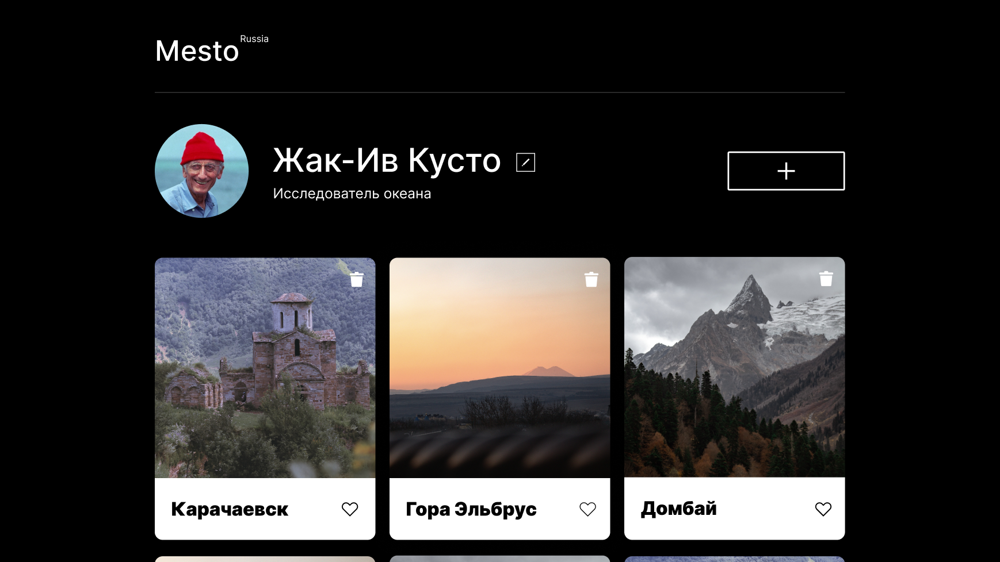

<h1 align="center"></h1>

## Краткое описание:

<p align="Left"> Проект "Mesto" является учебным проектом-сайтом, созданным в рамках обучения в Yandex Практикуме. Основной функциональностью сайта является возможность пользователями делиться своими фотографиями, просматривать фотографии других пользователей и оставлять комментарии.</p>


## Функционал:

- Добавление новой фотографии пользователем.
- Возможность поставить лайк любой фотографии.
- Возможность удалить свою фотографию.
- Возможность открыть фотографию в полноэкранном режиме для более детального просмотра.
- Появление попап окна для редактирования профиля пользователя.
- Адаптивная вёрстка, позволяющая корректно отображать сайт на различных устройствах: от компьютеров до мобильных телефонов.


<a href="" target="_blank" align="center"></a>

## Технологии, использованные при создании:

- Flexbox
- Grid Layout
- CSS - animation
- Методология БЭМ
- Файловая структура BEM Nested
- JavaScript (OOP, Asynchronous JS, DOM API, Fetch API)
- Валидация форм на стороне пользователя
- Адаптивная верстка (мобильные устройства, планшеты, десктопы)
- Webpack

  Проект сверстан по методологии BEM. При верстке приоритетно использована технология Grid Layout, местами используется flexbox. Все интерактивные элементы анимированы. Все контентные блоки, включая блок с карточками, контентонезависимы.

## Языки:

- HTML
- CSS
- JavaScript

## Локальная установка:

В командной строке перейдите в папку, где будет развернут проект. После чего скопируйте его с GitHub:
```sh
`$ git clone git@github.com:phillharmonia/mesto-project.git`
```

Далее переходим в папку с проектом и устанавливаем компоненты:
```sh
`$ npm install`
```

После этого нужно собрать проект:
```sh
`$ npm run build`
```

Далее можно запускать проект на локальном сервере:
```sh
`$ npm run dev`
```

## В конфигурационном файле package.json настроены три варианта запуска сборки проекта:

`$ npm run build` - для компиляции. Проект собирается локально, продукты сборки сохряняются в указанной директории.

`$ npm run dev` - для отладки. Помимо сборки, запускает на локальном сервере с автоматической <<горячей>> перезагрузкой при детектировании изменений в исходных кодах.

`$ npm run deploy` - для релиза. Выкладывает релизную версию в ветку `gh-pages` указанного репозитория.

## Установка сборщика (Webpack)

`npm init` - _добаляет конфигурационный файл package.json по умолчанию_

`npm i webpack --save-dev` - _устанавливает пакет webpack в проект, записывает его в зависимости для разработки_

`npm i webpack-cli --save-dev` - _устанавливает пакет интерфейса командной строки для webpack'а_

`npm i webpack-dev-server --save-dev` - _устанавливает пакет локального сервера_

## Установка транспилятора (Babel)

`npm i babel-loader --save-dev` - _устанавливает пакет транспилятора_

Дополнительные пакеты для работы с транспилятором:

`npm i @babel/cli --save-dev`

`npm i @babel/core --save-dev`

`npm i @babel/preset-env --save-dev`

`npm i core-js@3.4.1 --save`

`npm install --save babel-polyfill` - _устанавливает полифилы для транспилятора_

## Установка минификатора

`npm i mini-css-extract-plugin --save-dev` - _устанавливает пакет минификатора_

`npm i css-loader --save-dev` - _устанавливает пакет CSS-загрузчика_

### Установка "горячей" перезагрузки

`npm i webpack-md5-hash --save-dev` - _устанавливает пакет подсчёта хеша_

## Установка обработчика CSS-загрузчика

`npm i postcss-loader --save-dev` - _устанавливает пакет подключения плагина PostCSS к Webpack'у_

`npm i autoprefixer --save-dev` - _установщик вендорных префиксов_

`npm i cssnano --save-dev` - _минификатор CSS_

## Деплой

`npm install gh-pages --save-dev` - _выкладывает проект на gh-pages_

`npm install html-webpack-plugin --save-dev` - _"учит" вебпак работать с HTML_

`npm install --save-dev cross-env` - _пакет для использования глобальных переменных_

## Ссылки:

[Макет 1](https://www.figma.com/file/2cn9N9jSkmxD84oJik7xL7/JavaScript.-Sprint-4?node-id=0%3A1)

[Макет 2](https://www.figma.com/file/bjyvbKKJN2naO0ucURl2Z0/JavaScript.-Sprint-5?node-id=0%3A1)

[Макет 3](https://www.figma.com/file/kRVLKwYG3d1HGLvh7JFWRT/JavaScript.-Sprint-6?node-id=0%3A1)

[Макет 4](https://www.figma.com/file/PSdQFRHoxXJFs2FH8IXViF/JavaScript-9-sprint?node-id=0%3A1)
